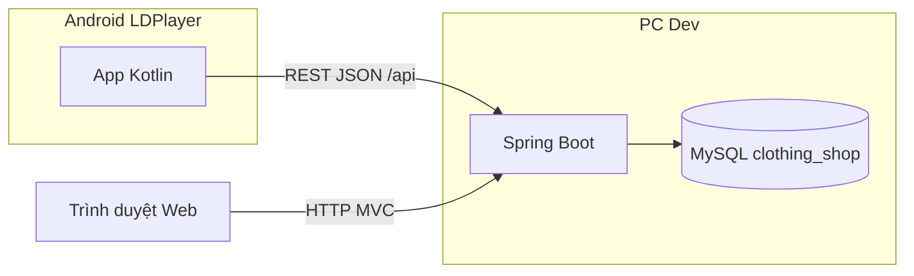

# Prompt & tài liệu hướng dẫn — App Android cửa hàng thời trang (đồ án)

Tài liệu này gom **yêu cầu đồ án** (Java Spring MVC/Web + Lập trình Android, **dùng chung MySQL qua REST**), hướng dẫn **LDPlayer**, contract **API thực tế** của backend `clothing-shop`, và **khối PROMPT** copy-paste cho AI trong Android Studio / Cursor.

> **Prompt một khối (đầy đủ nhất — dùng cho đồ án):** mở file [`PROMPT_HOAN_CHINH.txt`](PROMPT_HOAN_CHINH.txt), copy **toàn bộ** nội dung và dán vào AI. File đã gộp kiến trúc, LDPlayer, API, checklist chức năng, stack Android, UI, bảo mật, giao nộp và yêu cầu sinh code.

---

## 1. Bối cảnh đồ án (trình bày trong báo cáo)

| Thành phần | Công nghệ | Vai trò |
|------------|-----------|---------|
| Web | Spring Boot (MVC + Thymeleaf), Spring Security, JPA, MySQL | Quản trị + bán hàng trên trình duyệt |
| Server API | Spring REST (`/api/**`) | Cùng một ứng dụng Spring Boot, **cùng database** với web |
| Mobile | Android (Kotlin), Android Studio / LDPlayer | Khách mua hàng trên điện thoại (mô phỏng) |

**Nguyên tắc:** App Android **không** kết nối trực tiếp MySQL. Chỉ gọi **HTTP/HTTPS** tới Spring Boot. “Dùng chung database” = **cùng schema MySQL** (`clothing_shop`), do **một backend** quản lý.

---

## 2. Sơ đồ kiến trúc (đưa vào báo cáo)



---

## 3. Mạng & LDPlayer (bắt buộc làm đúng khi demo)

### 3.1. Vì sao không dùng `localhost` trong app?

Trong LDPlayer/emulator, `localhost` / `127.0.0.1` trỏ vào **chính máy ảo**, không phải PC đang chạy Spring Boot.

### 3.2. Cách cấu hình khuyến nghị

1. Chạy Spring Boot trên PC (port **8081** theo `application.properties`).
2. Backend đã cấu hình `server.address=0.0.0.0` để lắng nghe mọi giao diện mạng → máy ảo/LAN gọi được.
3. Trên Windows, mở **PowerShell / CMD**: `ipconfig` → lấy **IPv4** (Wi‑Fi hoặc Ethernet), ví dụ `192.168.1.47`.
4. Trong app Android đặt:

   `BASE_URL = "http://192.168.1.47:8081/api/"`

   (Thay bằng IP thật của máy bạn; giữ dấu `/` cuối nếu Retrofit `@Url` không dùng full path.)

5. **Firewall:** cho phép inbound **TCP 8081** (hoặc tạm tắt firewall khi demo trong mạng tin cậy).
6. LDPlayer và PC **cùng mạng** (cùng Wi‑Fi router) nếu dùng IP LAN.

### 3.3. Ghi chú

- Một số bản LDPlayer có thể thử `http://10.0.2.2:8081/api` (giống AVD); **không đảm bảo mọi phiên bản**. **Ưu tiên IP LAN.**
- Emulator Android Studio: thường dùng `10.0.2.2` thay cho localhost của host.

---

## 4. Contract REST API backend (Clothing Shop — đối chiếu code `ApiController`)

**Base path:** `/api`  
**Content-Type:** `application/json` cho POST  
**Encoding:** UTF-8  

### 4.1. Bảng endpoint

| Phương thức | Đường dẫn | Mô tả | Query / Body |
|-------------|-----------|--------|--------------|
| GET | `/api/health` | Kiểm tra server & mạng | — |
| GET | `/api/categories` | Tất cả danh mục | — |
| GET | `/api/products` | Danh sách + phân trang + lọc | `keyword?`, `categoryId?`, `page` (default 0), `size` (default 10) |
| GET | `/api/products/{id}` | Chi tiết sản phẩm | — |
| POST | `/api/register` | Đăng ký | JSON: `username`, `email`, `password`, `fullName?`, `phone?` |
| POST | `/api/login` | Đăng nhập | JSON: `username`, `password` |
| POST | `/api/cart/add` | Thêm vào giỏ | JSON: `userId`, `productId`, `quantity` (optional, default 1) |
| GET | `/api/cart/user/{userId}` | Xem giỏ | — |
| POST | `/api/orders` | Đặt hàng | JSON: `userId`, `address`, `phone`, `note?`, `items?` (mảng) |
| GET | `/api/orders/user/{userId}` | Lịch sử đơn | — |

### 4.2. Dạng response thống nhất

- Thành công thường có: `"success": true`, và `data` hoặc các field như `orderId`, `message`.
- Lỗi: `"success": false`, `"message": "..."`; HTTP 4xx/5xx tùy trường hợp.

### 4.3. Đặt hàng với `items` (đồng bộ giỏ server)

`POST /api/orders` có thể gửi thêm:

```json
{
  "userId": 1,
  "address": "123 Đường ABC",
  "phone": "0909123456",
  "note": "Giao buổi sáng",
  "items": [
    { "productId": 2, "quantity": 1 },
    { "productId": 5, "quantity": 2 }
  ]
}
```

Server sẽ xóa giỏ cũ, thêm các dòng trên vào giỏ server, rồi tạo đơn (cùng logic với web).

### 4.4. Ảnh sản phẩm

- JSON Product có thể có `imageUrl` (từ getter) hoặc `image`.
- Nếu giá trị là đường dẫn tương đối (`/images/...`, `/uploads/...`), ghép với host:  
  `http://<IP>:8081` + path (tránh double slash).

---

## 5. So sánh chức năng Web vs App (checklist đồ án)

| Chức năng (Web) | App Android (yêu cầu) | API / Ghi chú |
|-----------------|------------------------|----------------|
| Trang chủ, danh mục, gợi ý sản phẩm | Home: danh mục + lưới sản phẩm (có thể 2 section: “Gợi ý” / “Mới” bằng 2 lần gọi `GET /api/products` với `size` khác nhau) | `/api/categories`, `/api/products` |
| Danh sách + tìm kiếm + lọc danh mục | Search + filter `categoryId` + phân trang | `/api/products` |
| Chi tiết sản phẩm | Màn detail + ảnh + thêm giỏ | `/api/products/{id}`, `/api/cart/add` |
| Đăng ký / đăng nhập | Register + Login, lưu `userId` | `/api/register`, `/api/login` |
| Giỏ hàng | Hiển thị giỏ + tổng tiền | `GET /api/cart/user/{userId}` |
| Checkout / đặt hàng | Form địa chỉ, ĐT, ghi chú → đặt hàng | `POST /api/orders` (+ `items` nếu cần) |
| Lịch sử đơn | Danh sách đơn (trạng thái, tổng tiền) | `GET /api/orders/user/{userId}` |
| Cập nhật profile (web có `/user/profile`) | **Tùy đồ án:** lưu local sau login hoặc **mở rộng API** `PUT /api/users/{id}` trên Spring (làm thêm nếu thầy yêu cầu đủ 100%) | Hiện backend **chưa** có API profile cho mobile |

**Khoảng trống có thể bổ sung (để “đủ như web”):**

- API cập nhật thông tin user (tên, SĐT, địa chỉ).
- API xóa / cập nhật số lượng dòng giỏ (web có POST `/cart/update`, `/cart/remove/{id}` — hiện mobile chỉ `POST /api/cart/add`; có thể đồng bộ bằng cách gọi `items` khi đặt hàng hoặc mở rộng backend).

Việc **ghi rõ phần “giới hạn API” + hướng mở rộng** trong báo cáo thường được chấp nhận nếu luồng chính (xem SP → giỏ → đặt hàng → lịch sử) hoạt động.

---

## 6. Yêu cầu kỹ thuật Android (cho báo cáo & chấm điểm)

### 6.1. Stack đề xuất

- Kotlin, **Jetpack Compose** + **Material 3**
- MinSdk 24–26, targetSdk mới nhất ổn định
- **MVVM**: ViewModel + `StateFlow` / `UiState` sealed class
- **Retrofit 2** + **OkHttp** (logging chỉ debug) + **Gson** hoặc **Moshi**
- **Coroutines**
- **Navigation Compose** (single Activity)
- **Coil** load ảnh
- **DataStore** (Preferences) lưu `userId`, `username`, … — **không** lưu password

### 6.2. Cấu trúc package gợi ý

```
com.shop.android/
  data/
    remote/      # ApiService, Retrofit, dto
    repository/ # ShopRepository
  domain/        # model thuần Kotlin
  ui/
    theme/
    screens/     # home, search, detail, cart, checkout, orders, auth, splash
  util/          # NetworkResult, ImageUrlResolver
```

### 6.3. UX “hiện đại”

- Bottom bar: **Trang chủ / Tìm·Danh mục / Giỏ / Tài khoản**
- Card sản phẩm bo góc, ảnh đẹp, giá nổi bật
- Pull-to-refresh, loading, empty state, Snackbar lỗi
- Dark mode (optional)

### 6.4. Bảo mật & pháp lý đồ án

- Chỉ **debug** cho phép HTTP cleartext (`networkSecurityConfig`).
- Release nên HTTPS (nếu triển khai thật).
- Không commit `BASE_URL` chứa secret; dùng `local.properties` / `BuildConfig`.

---

## 7. Kịch bản kiểm thử (demo với LDPlayer)

1. Mở Spring Boot, MySQL (XAMPP), kiểm tra `GET http://<IP_PC>:8081/api/health` trên trình duyệt PC.
2. Cài app trên LDPlayer; cấu `BASE_URL` = `http://<IP_PC>:8081/api/`.
3. Splash → health OK.
4. Home: danh mục + sản phẩm load được; ảnh hiển thị.
5. Chi tiết SP → thêm giỏ (sau login).
6. Login sai → thông báo; login đúng → lưu user.
7. Giỏ → đúng tổng tiền (so sánh với web cùng user).
8. Đặt hàng → thành công, có `orderId`; kiểm tra trên web Admin / Lịch sử.
9. Lịch sử đơn trên app khớp dữ liệu server.

---

## 8. Gợi ý chương báo cáo / slide

1. Tổng quan đề tài, mục tiêu, phạm vi  
2. Phân tích web + CSDL (ER tối giản)  
3. Thiết kế REST (bảng endpoint)  
4. Thiết kế Android: kiến trúc, màn hình, luồng dữ liệu  
5. Kết nối LDPlayer + mạng + ảnh chụp màn hình  
6. Kết quả test + hạn chế & hướng phát triển  

---

## 9. PROMPT MỞ RỘNG — Bản rút gọn (tham khảo)

**Khuyến nghị:** dùng bản đầy đủ tại [`PROMPT_HOAN_CHINH.txt`](PROMPT_HOAN_CHINH.txt). Dưới đây là bản rút gọn nếu chat giới hạn độ dài.

```
Bạn là senior Android (Kotlin). Đây là đồ án tích hợp với backend Spring Boot + MySQL có sẵn.

## Bối cảnh
- Web + API cùng một project Spring Boot; MySQL schema clothing_shop.
- App Android CHỈ gọi REST, KHÔNG kết nối JDBC/MySQL trực tiếp.
- Thiết bị demo: LDPlayer trên PC Windows. Trong app KHÔNG dùng localhost/127.0.0.1 để gọi server trên PC host.
- BASE_URL dạng: http://<IPv4_từ_ipconfig_máy_chạy_Spring>:8081/api/ (ví dụ http://192.168.1.47:8081/api/)
- Server lắng nghe 0.0.0.0:8081; mở firewall TCP 8081 khi demo.

## API (bắt buộc implement client đúng path & JSON)
- GET /api/health
- GET /api/categories → { success, data: [Category] }
- GET /api/products?keyword=&categoryId=&page=0&size=12 → { success, data: [Product], currentPage, totalItems, totalPages }
- GET /api/products/{id} → { success, data: Product } | 404
- POST /api/register — body: username, email, password, optional fullName, phone
- POST /api/login — body: username, password → data có id, username, email, fullName, role, phone, address
- POST /api/cart/add — body: userId, productId, quantity (optional)
- GET /api/cart/user/{userId} — data: lines, total
- POST /api/orders — body: userId, address, phone, note?, items?: [{ productId, quantity }] để sync server cart rồi tạo đơn
- GET /api/orders/user/{userId} — data: danh sách đơn rút gọn (id, totalPrice, status, statusDisplay, createdAt, shippingAddress, itemCount)

## Ảnh
- Dùng field imageUrl hoặc image từ Product; nếu path tương đối thì ghép http://HOST:8081 + path.
- Coil + placeholder/error.

## Chức năng app (par với web bán hàng)
1. Splash → gọi /api/health, fail thì màn lỗi + retry.
2. Home: categories chip/list + grid products (pagination/infinite hoặc nút load more), pull-to-refresh.
3. Search/filter: keyword + categoryId.
4. Product detail từ GET /api/products/{id}; thêm giỏ cần login (POST /api/cart/add với userId).
5. Cart: GET cart; hiển thị tổng; checkout form address/phone/note → POST /api/orders (kèm items từ giỏ local nếu cần).
6. Orders: GET /api/orders/user/{userId}.
7. Auth: register + login; lưu userId + profile cơ bản trong DataStore; logout xóa dữ liệu.

## UI
- Jetpack Compose + Material 3, bottom navigation, hiện đại (card bo góc, typography rõ, snackbar lỗi, loading/empty).

## Code quality
- MVVM, Repository, sealed UiState, coroutines.
- Retrofit + OkHttp; BASE_URL cấu hình debug qua BuildConfig/local.properties.
- networkSecurityConfig cleartext chỉ debug.
- README: hướng dẫn LDPlayer + đổi IP + checklist test API.

Hãy tạo project Gradle Kotlin DSL đủ build được: dependencies, ApiService (Retrofit), models, repository, ViewModels, NavHost, các màn Splash/Home/Search/Detail/Cart/Checkout/Orders/Login/Register, theme Material 3.
```

---

*Bạn có thể đặt tên file hoặc đính kèm tài liệu này vào báo cáo Word/PDF như phụ lục “Đặc tả kết nối Android — Spring Boot”.*
